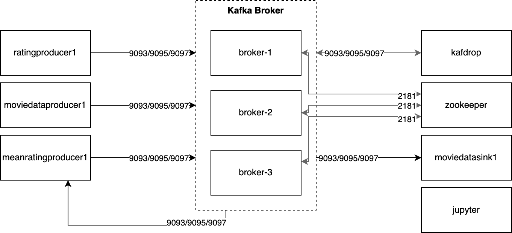

# Teil 1

## Einführung

*Hier werden die verwendeten Daten beschrieben und die geplanten Tasks erklärt.*

Für diese Mini-Challenge werden [MovieLens-Daten](https://grouplens.org/datasets/movielens/) verwendet. Das ausgewählte Datenset enthält 27'753'444 Bewertungen zu 58'098 Filmen. Die Bewertungen befinden sich auf der Skala von 1 bis 5, wobei 5 die beste Bewertung darstellt. Die Bewertungen sind zwar Dezimalzahlen, können aber nur in 0.5-Schritten abgegeben werden. Neben den Bewertungen sind auch Informationen über die Filme verfügbar. Neben dem Titel und dem Erscheinungsjahr sind zu jedem Film eine beliebige Anzahl an Genres verfügbar. Die Bewertungen und die Film-Metainformationen sollen eingelesen und auf einem Datenträger gespeichert werden. Zudem soll aus den Bewertungen ein Durchschnittswert pro Film berechnet werden, der ebenfalls mit den Metainformationen gespeichert werden soll. Die riesige Anzahl von Bewertungen erfordert eine effiziente Berechnung der Bewertungen und der Durschnitt soll im Speicher der Metainformationen nur aktualisiert werden, wenn sich dieser wirklich aktualisiert hat. Die Metainformationen eines Films ändern sich nicht mehr, sobald sie einmal erfasst wurden.

## Experimente mit Kafka

*Hier sind die Experimente und Beobachtungen zur Aufgabe 4 von Teil 1 der Mini-Challenge beschrieben.*

Durch das Starten des Producers im Kafka-Tutorial wird ein neues Topic angelegt und es wird dabei scheinbar zufällig einer der drei Broker als Leader ausgewählt. Beim Starten des Consumers werden die publizierten Messages einzeln abgerufen und beim erneuten Starten des Consumers werden keine neuen mehr gefunden. In Kafdrop lässt sich aber nicht erkennen, welche der Messages bereits abgearbeitet wurde. Durch das Stoppen des Controller-Brokers wird der Controller-Status einem noch verfügbaren Broker übertragen. Das Publizieren und Abrufen von Messages funktioniert weiterhin, auch wenn der angegebene Broker heruntergefahren wird. Diese Angabe wird nur benötigt, um initial alle verfügbaren Broker abzurufen. Der Client wechselt dann automatisch zu einem verfügbaren Broker, wenn der aktuelle nicht mehr erreichbar ist. Da die Messages über alle Broker synchronisiert werden, ist dieser Fallback einfach möglich. In Kafdrop werden die Broker angezeigt, die nicht verfügbar sind und welche Partitionen under-replicated sind. Für welche es also zu wenige verfügbare Broker gibt, um die Daten zu replizieren. Der Leader-Status wechselt auch auf noch verfügbare Broker. Wenn der Broker wieder gestartet wird, wechselt der Leader-Status aber nicht automatisch zurück auf den bisherigen Broker.

## Übersicht Komponenten

*Hier wird die Architektur des Systems vorgestellt.*

Das System besteht hauptsächlich aus drei Brokern, drei Producern und zwei Consumern. Für die Kommunikation zwischen den Brokern steht eine Zookeeper-Instanz zur Verfügung und um die Messages auf den Brokern manuell zu untersuchen ist Kafdrop auf einem Container eingerichtet. Um Python-Code auszuführen gibt es zudem einen Container mit installiertem Jupyter.

Die Producer und Consumer kommunizieren mit einem der drei Broker. Für die initiale Verbindung muss mindestens ein Broker angegebe werden, von welchem dann die Informationen zu den restlichen Brokern abgerufen werden. Die Messages werden von den Producern mittels [Protocol Buffers](https://developers.google.com/protocol-buffers/) in binäre Daten umgewandelt und an die Broker übermittelt und von diesen durch die Consumer wieder abgerufen und wieder in Python-Objekte umgewandelt um weiterverwarbeitet zu werden. Die Serialisierung in Protocol Buffers wird verwendet, da sie einfach aufgebaut und wenig Daten in ihrer serialisierten Form benötigt.

Der Container **ratingproducer1** publiziert für jedes neue Rating eine Message im Topic `ratings`, so dass es für die anderen Microservices zur Verfügung steht. Zum Testen werden die Ratings aus einer CSV-Datei eingelesen und ohne Verzögerung publiziert.

Ähnlich funktioniert der Service im Container **moviedataproducer1**. Hier wird für jeden neuen Film eine neue Message im Topic `movies` publiziert. Da beim Testen nicht allzu viele Daten zur Verfügung stehen, werden die Messages mit einer ungefähren Frequenz von 1 Hz publiziert.

Im Container **meanratingproducer1** befindet sich eine Kombination aus Producer und Consumer. Dieser Service berechnet bei jedem neuen Rating das Durchschnittsrating pro Film neu, indem es Messages aus dem Topic **ratings** abruft und den neuen Durchschnittswert im Topic `mean-ratings` publiziert. Um diesen Wert berechnen zu können, werden die bisherige Anzahl an Ratings und die Summe der bisherigen Ratings pro Film in einer internen CSV-Datei gespeichert. So arbeitet der Service möglichst unabhängig von den anderen Services.

Der Service **moviedatasink** ist ein Consumer, der Messages aus den Topics `movies` und `mean-ratings` abruft und die Daten in einer CSV-Datei ableget. Dabei werden die Daten pro Film abgelegt. Dieser Service könnte eine Schnittstelle zur Verfügung stellen, aus welcher dann die Filmdaten und das mittlere Rating wieder abgerufen werden können.

Die einzige Abhängigkeit der Container für die Producer und Consumer sind die Kafka-Broker. Sie haben keine direkte Verbindung untereinander. Die Images der Container enthalten bereits alle benötigten Libraries, Daten und Dateien und starten ihre Services automatisch nach dem Start. Für die Kommunikation mit Kafka wurden die Klassen `MessageProducer` und `MessageProcessor` erstellt, die die Kafka-Library abstrahieren. So kann im nächsten Schritt der Kommunikations-Service ausgetauscht werden, ohne dass der Code der einzelnen Services verändert werden muss.
