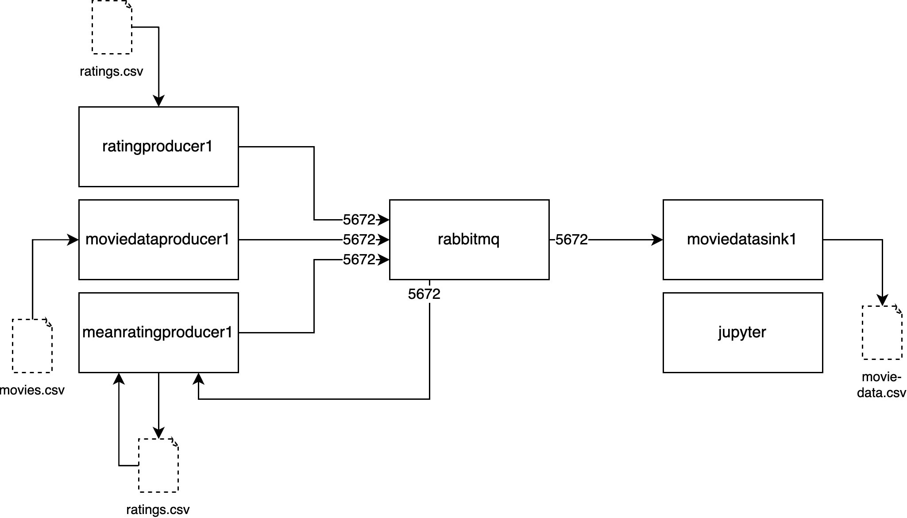

# Teil 2

## Container-Interaktion

Die Kafka-Broker wurden nun durch einen einzelnen RabbitMQ-Service ersetzt. RabbitMQ lässt sich aber wie Kafka auch skalieren und es kann ein Cluster bestehend aus mehreren RabbitMQ-Nodes konfiguriert werden. Die Producer und Consumer kommunizieren über das Protokoll AMQP 0-9-1 mit RabbitMQ, das über Port 5672 läuft. Dazu wird nun in der Datei `message_service.py` das Python-Paket `pika` verwendet. Die einzelnen Producer und Consumer mussten aufgrund der Abstraktion nicht direkt verändert werden.

## Communication Patterns

Kafka kann auf unterschiedlichste Arten verwendet werden und es können dadurch verschiedene Communication Patterns umgesetzt werden. Zum Beispiel können Varianten des klassichen Publish-Subscribe-Patterns umgesetzt werden. Ein wichtiger Unterschied bei Kafka ist jedoch, dass die Consumer die Messages vom Broker abholen und diese nicht vom Broker direkt übermittelt werden. Darum werden die Messages auch auf diesen persistiert und erst nach spezifischen Regeln (Zeit oder Überschreiben per Key) wieder gelöscht. Dadurch können bereits verarbeitete Messages bei einem Fehler oder Ausfall nochmals abgerufen werden um die Datenkonsistenz im betroffenen System wieder zu erreichen.

RabbitMQ implementiert ein klassisches PubSub-Pattern, bei welchem sich die Consumer beim Start beim Broker für bestimmte Events (Topics) melden und diese vom Broker direkt übermittelt werden, sobald solche publiziert werden. Das System garantiert, dass Messages zugestellt werden. Sobald sie jedoch zugestellt wurden, verschwinden sie und lassen sich nicht erneut zustellen. Aber auch dieses System lässt sich gut skalieren. Das Fehlen von Partitionen ermöglicht es jedoch nicht, dass mehrere Consumer-Instanzen Messages in einer vorbestimmten Reihenfolge verarbeiten. Die Instanzen würden einfach die gleiche Message-Queue abarbeiten.

Aufgrund des Aufbaus von Kafkas können unterschiedliche Typen von Topics erstellt werden. Solche in welche Messages bei gewissen Aktionen publiziert werden (event topics). Services können so andere informieren, wenn beispielsweise sich eine neue Person registriert hat oder diese ihren Benutzernamen aktualisiert hat. Andererseits kann jeweils die aktuelle Version von Daten publiziert werden (entity topics). So erhalten alle Services jeweils die aktuellsten Daten, auch wenn sie zum ersten Mal gestartet wurden und sie ihre benötigten Daten bisher noch nicht sammeln konnten.

Neben dieser asynchronen Variante gibt es die synchrone Request-Response-Kommunikation. Häufig findet diese über HTTP(S) APIs statt, indem eine Anfrage an einen bestimmten Service gesendet wird und diese direkt beantwortet. Wenn alle Server bekannt sind, die angesprochen werden müssen, ist dies eine einfach umzusetzende Strategie. Sie ist zum Beispiel notwendig, wenn eine Antwort benötigt wird, um sie den Nutzer*innen nach einer Aktion anzuzeigen. Dies kann aber auch mit Messaging-Systemen und auch Kafka mit asynchronen Nachrichten umgesetzt werden. Der Vorteil wäre, dass die Nachrichten gespeichet würden, bis sie von jemandem verarbeitet werden und so zum Beispiel kurzfristige Ausfälle überbrückt werden können. Ausserdem müssen die Consumer die Anfrage nicht sofort verarbeiten, sondern es wird gewartet, bis einer der Consumer wieder verfügbare Ressourcen dazu hat. Ein Nachteil an HTTP(s) als Übertragungsprotokoll ist, dass es für die meist relativ kleinen Messages einen grossen Overhead generiert. Dedizierte Protokolle die für Messaging-Systeme entwickelt wurden, eignen sich besser um grosse Mengen an Messages zu verteilen.

Da Kafka im Gegensatz zu klassischen PubSub-Systemen die Messages persistiert und sich diese auch merkt nachdem sie abgerufen werden, kann es auch als Zustandsspeicher verwendet werden. Komplexere Consumer können darin zum Beispiel jeweils ihren aktuellen Zustand ablegen, wenn das standardmässige Verschieben des Offsets von Kafka nicht ausreicht um verarbeitete Messages zu markieren.

Für diese Anwendung ist Kafka gut geeignet. Da die Consumer Daten für sich abspeichern, würden diese bei einem Fehler in der Consumer-Implementierung oder einem Ausfall dieser inkonsistent werden. Mit Kafka können die gespicherten Daten wieder korrigiert werden, indem betroffene Messages erneut verarbeitet werden. Es bietet auch einige Features wie die Partitionen, die eine Skalierung des Systems vereinfachen.

## Integration in Container-Orchestrierung

Da das System auf Microservices basiert, kann es nun relativ einfach skaliert werden. Wenn das System von Nutzer\*innen aus unterschiedlichen Ländern verwendet wird, kann es sinnvoll sein, die Daten näher bei diesen zu speichern. Dies hilft die Latenz zu reduzieren, was dazu führt, dass die Daten von den Nutzer\*innen schneller abgerufen werden können. Dazu können mehrere moviedatasink-Container erstellt und auf unterschiedliche Rechenzentren verteilt werden. Wenn die Daten für die Filme und die Ratings aus mehreren Quellen stammen, wäre es sinnvoll pro Quelle einen Producer-Container zu erstellen. Bei sehr vielen Ratings kann es auch helfen mehrere meanratingproducer-Container hochzufahren und deren Aufgaben aufzuteilen. Jeder Container könnte für gewisse Filme zuständig sein (Unterscheidung per ID oder Genres möglich).

Ein Container-Orchestrierungssystem kann sicherstellen, dass die Container miteinander in einem Netzwerk rechenzentrumsübergreifend kommunizieren können und dass abgestürzte Container automatisch neugestartet werden. Es ist wichtig, dass die Ausfallzeit der Container möglichst gering ist, da sonst die Daten im System nicht mehr aktuell sind. Bei grösseren Problemen könnte ein solches Orchestrierungssystem wie Kubernetes dafür sorgen, dass ausgefallene Services in einem Rechenzentrum durch Services in anderen Rechenzentren ersetzt werden. Die Anzahl Services kann auch je nach Bedarf verändert werden. Zu Zeitpunkten, in welchen viele Nutzer*innen die Services gleichzeitig verwenden, können zusätzliche Services gestartet werden und später wieder heruntergefahren werden, um Kosten zu sparen. Die ratinproducer- und moviedataproducer-Services können auch je nach verfügbaren neuen Daten gestartet werden.

