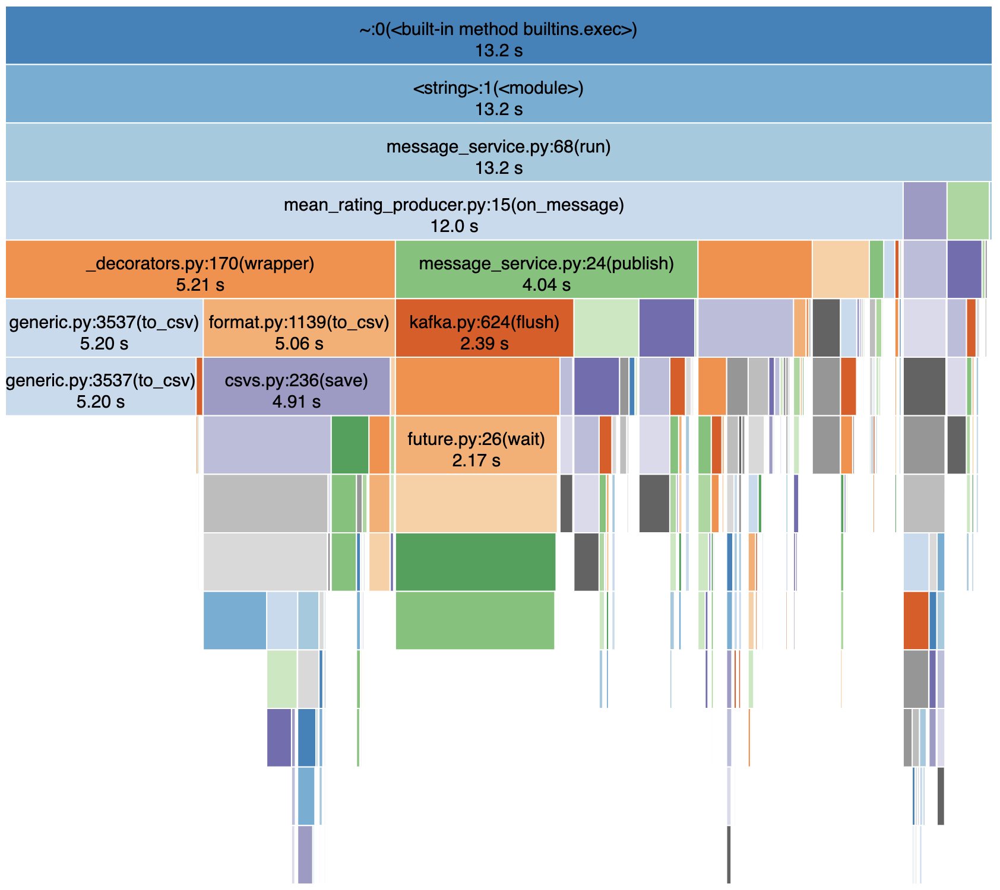
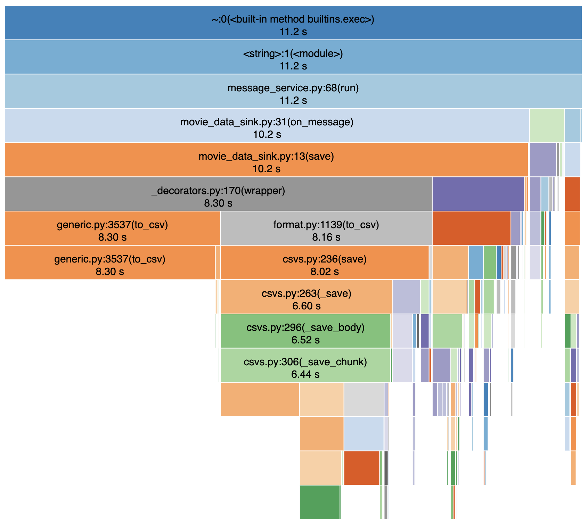
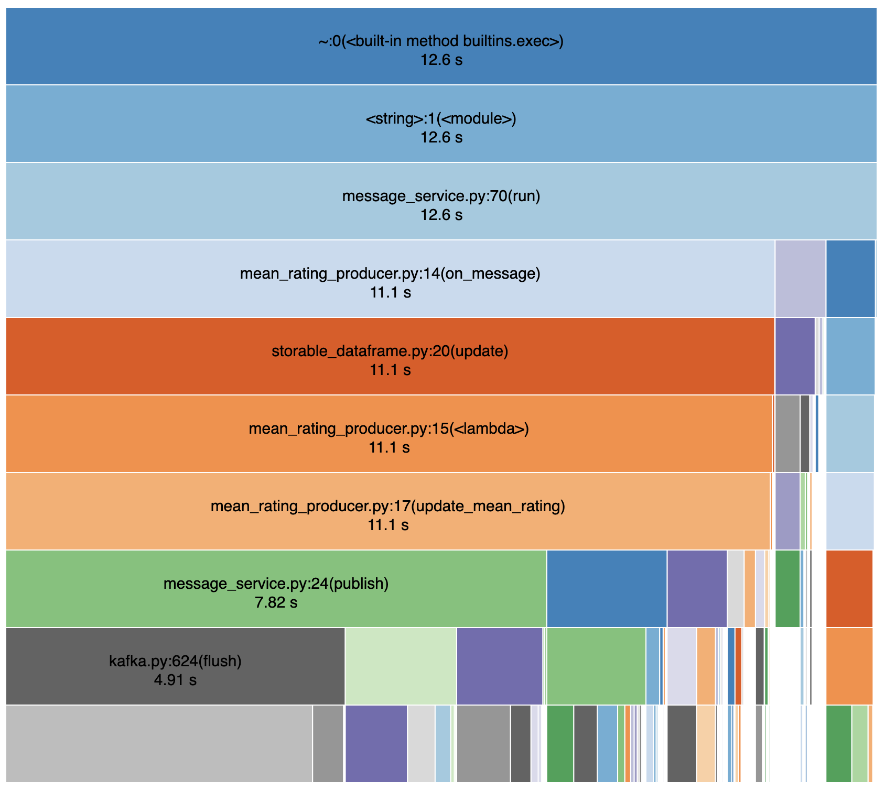
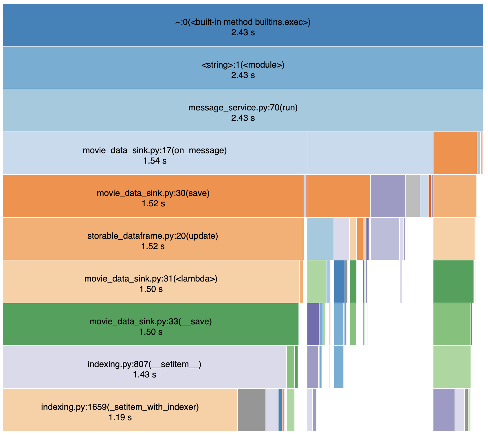
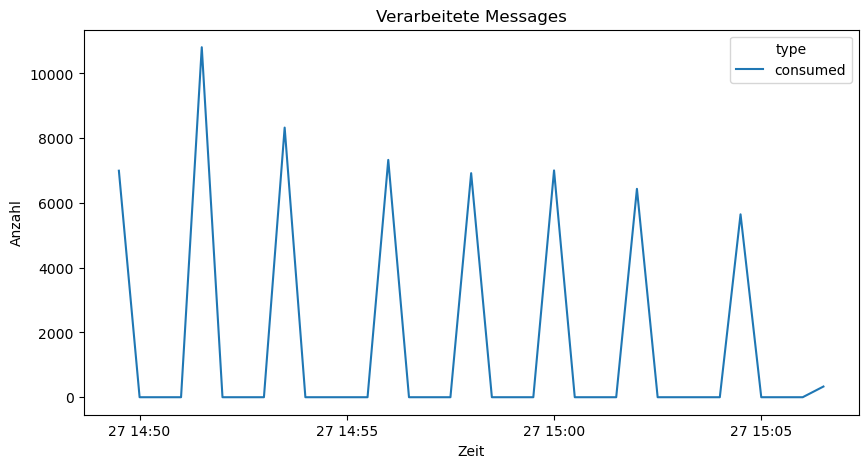
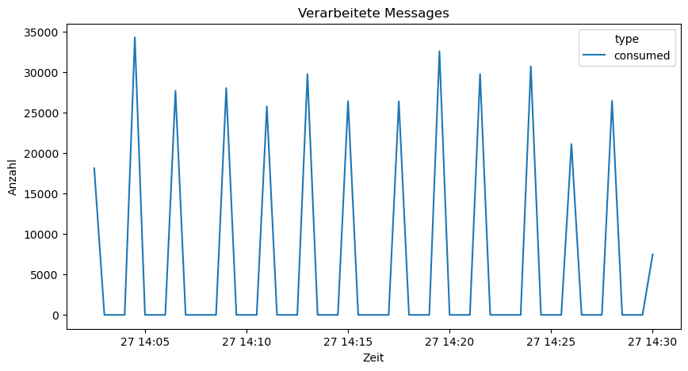

# Teil 3

Alle Analysen und Optimierungen für diesen Teil wurden mit Kafka als Kommunikationssystem vorgenommen.

## Skalierung Kommunikationsframework

### Experiment 1

*siehe `reports/experiment-1.mov`*

In diesem Experiment müssen zwei Kafka-Broker die Messages von zehn ratingproducer und dem meanratingproducer und moviedataproducer verarbeiten. Da die Messages der ratingproducer ohne Verzögerung publiziert werden, kommen die Broker an ihre Grenzen und einzelne ratingproducer können keine Verbindung während 60 Sekunden aufbauen, was dazu führt, dass diese beendet werden.

### Experiment 2

*siehe `reports/experiment-2.mov`*

Für dieses Experiment wurde das Jupyter Notebook `reports/system-performance-analysis.ipynb` erstellt, dass die Anzahl publizierter und konsumierter Messages über eine Zeitskala darstellt. So kann man erkennen, wie sich der Message-Fluss nach und von den Kafka-Brokern verhält, wenn gewisse Aktionen durchgeführt werden. Dazu wird von den Klassen `MessageProducer` und `MessageProcessor` neu jeweilse eine weitere Message mit Metainformationen in spezifische Topics publiziert, wenn diese eine Message publizieren oder verarbeiten. Diese Meta-Message enthält neben dem Zeitstempel auch den Namen des Producers oder Consumers. Im Notebook wurde nun ein Consumer implementiert, der die Messages aus diesen Topics abruft und zählt.

Zu Beginn des Experiments wird ein Docker-System mit drei Kafka-Brokern gestartet. Anschliessend wird als ein Producer und Consumer ein ratingproducer gestartet, der fortlaufend Nachrichten publiziert. In der Grafik des Analyse-Notebooks kann man erkennen, dass über die Zeit hinweg (mal vom Start abgesehen) jeweils ca. 20'000 Nachrichten pro Zeiteinhait publiziert werden. Anschliessend werden Kafka-Broker 2 und 3 gestoppt und sobald die neusten Meta-Messages verarbeitet wurden, lässt sich in der Grafik erkennen, dass nun mehr Messages als vorher publiziert werden.

Dies liegt wohl daran, dass Kafka-Broker Systemressourcen brauchen, unabhängig ob sie Messages entgegennehmen oder nicht. Durch das Abschalten der zusätzlichen Broker werden diese Ressourcen nun frei und können von Broker 1 und dem ratingproducer verwendet werden, um mehr Messages zu publizieren und entgegenzunehmen. Weiter fällt der Aufwand für die Replikation der Messages auf den weiteren Brokern weg, was auch Ressourcen freigibt.

Das Verwenden von mehreren Brokern ist vor allem dann sinnvoll, wenn sich diese auf unterschiedlichen Servern befinden, da so wirklich die Ausfallsicherheit erhöht werden kann. Eine Leistungssteigerung scheinen mehrere Broker auf einem Server bei einem einzelnen Producer nicht zu bringen, eher im Gegenteil wie im Experiment erkennbar war.

## Performance Applikation

*Die Resultate wurden mit dem Jupyter Notebook `code-performance-analysis.ipynb` erstellt.*

### Data Generators

In den Data Generators wurden jeweils 3 x 100 Messages publiziert, was zehnmal wiederholt wurde. Dabei wurde jedes Mal wieder am Anfang der CSV-Datei begonnen. Folgende Mittelwerte und Standardabweichungen wurden erzielt. Zu beachten ist, dass das Senden der ersten 100 Messages jeweils länger dauerte als die folgenden 2 x 100, da das Einlesen der Datei merklich Zeit beansprucht.

```
Publishing 100 ratings: mean = 2.949841842000751s +/-0.5337330274469674s
Publishing 100 movies: mean = 3.6493610580000677s +/-0.04843011606422633s
```

### Data Processors

Beim **meanratingproducer** benötigt die Methode `run` aus `message_service.py` am meisten Zeit, wenn man auch die Zeit miteinrechnet, die Aufrufe von anderen Funktionen brauchen, die innerhalb der Funktion aufgerufen werden. An zweiter Stelle befindet sich `on_message` des Producers selbst.

```
   ncalls  tottime  percall  cumtime  percall filename:lineno(function)
        1    0.048    0.048   20.465   20.465 message_service.py:39(run)
     1000    0.175    0.000   20.347    0.020 mean_rating_producer.py:15(on_message)
2000/1000    0.040    0.000   13.854    0.014 _decorators.py:170(wrapper)
```

Auch wenn man nur die internal time beachtet, also die Zeit, die aufgerufene Funktionen benötigen, weglässt, dauert die `on_message`-Funktion relativ lange. Sie benötigt von allen selbst implementierten Funktionen am längsten.

```
   ncalls  tottime  percall  cumtime  percall filename:lineno(function)
[...]
274740/267740    0.197    0.000    0.387    0.000 {built-in method builtins.isinstance}
     1000    0.175    0.000   20.347    0.020 mean_rating_producer.py:15(on_message)
     1000    0.082    0.000   12.063    0.012 csvs.py:306(_save_chunk)
```

Die drei häufigsten aufgerufenen Funktionen sind diese:

```
   ncalls  tottime  percall  cumtime  percall filename:lineno(function)
274740/267740    0.197    0.000    0.387    0.000 {built-in method builtins.isinstance}
76220/68732    0.045    0.000    0.055    0.000 {built-in method builtins.len}
    60458    0.042    0.000    0.043    0.000 {built-in method builtins.getattr}
```

Und die folgenden Funktionen benötigten insgesamt am meisten Zeit (nur interne Zeit). Hier belegt eine Funktion den obersten Platz, die im Zusammenhang mit dem Abspeichern der CSV-Datei steht.

```
   ncalls  tottime  percall  cumtime  percall filename:lineno(function)
     1000    7.149    0.007    7.149    0.007 {pandas._libs.writers.write_csv_rows}
     4040    3.010    0.001    3.010    0.001 {method 'acquire' of '_thread.lock' objects}
     2248    2.598    0.001    2.598    0.001 {method 'astype' of 'numpy.ndarray' objects}
```

Beim **moviedatasink** werden die ersten drei Plätze bei der kumulativen Zeiten durch selbst implementierte Methoden belegt:

```
   ncalls  tottime  percall  cumtime  percall filename:lineno(function)
        1    0.025    0.025    9.833    9.833 message_service.py:39(run)
     1000    0.013    0.000    9.713    0.010 movie_data_sink.py:31(on_message)
     1000    0.034    0.000    9.700    0.010 movie_data_sink.py:13(save)
```

Wenn nur die interne Zeit beachtet wird, benötigt die `save`-Methode des MovideDataSinks am meisten Zeit. Diese löst das Speichern der CSV-Datei aus.

```
   ncalls  tottime  percall  cumtime  percall filename:lineno(function)
[...]
     1000    0.035    0.000    0.227    0.000 indexing.py:2037(_setitem_single_block)
     1000    0.034    0.000    9.700    0.010 movie_data_sink.py:13(save)
     1000    0.032    0.000    0.808    0.001 common.py:646(get_handle)
```

Die am häufigsten aufgerufenen Funktionen bei diesem Processor sind die gleichen wie beim ersten Processor und sind alle python-intern.

```
   ncalls  tottime  percall  cumtime  percall filename:lineno(function)
164264/157264    0.122    0.000    0.258    0.000 {built-in method builtins.isinstance}
43162/36474    0.030    0.000    0.040    0.000 {built-in method builtins.len}
    37260    0.019    0.000    0.020    0.000 {built-in method builtins.getattr}
```

Die am längsten dauernde Funktion (nur interne Zeit) ist wieder eine, die auf das Abspeichern der CSV-Datei hindeutet.

```
   ncalls  tottime  percall  cumtime  percall filename:lineno(function)
     1000    3.101    0.003    3.101    0.003 {pandas._libs.writers.write_csv_rows}
     2000    1.852    0.001    1.852    0.001 {method 'astype' of 'numpy.ndarray' objects}
     1000    1.145    0.001    1.145    0.001 {pandas._libs.missing.isnaobj2d}
```

### Visualisierungen von Profilings

Die folgende Grafik visualisiert obige Profiling-Resultate für den meanratingproducer. Diese sind auch in dieser Datei abgelegt: *profiles/mean_rating_producer.profile*



Und diese Grafik visualisiert die Ergebnisse aus dem Profiling des moviedatasink. Dieses ist hier abgelegt: *profiles/movie_data_processor.profile*



Beide Grafiken wurden mit [SnakeViz](https://jiffyclub.github.io/snakeviz/) generiert. Bei beiden ist schnell ersichtlich, dass viel Zeit für das Abspeichern der CSV-Datei benötigt wird. Dies ist erkennbar an den langen Balken für die `to_csv` Methoden von pandas. Im Falle des meanratingproducers wird auch viel Zeit für das Publizieren der neuen Message benötigt, was am Aufruf der Funktion `publish` aus dem `message_service.py` erkennbar ist.

### Memory-Analyse

Mittels `memory_profiler` Library wurden alle Producer und Processors einem Memory-Profiling unterzogen. Untersucht wurden jeweils die wichtigsten Methoden des jeweiligen Service. Bei allen anderen Funktionen scheint kein Speicherverbrauch aufgezeichnet zu werden, oder er ist tatsächlich jeweils so gering, dass er mit 0.0 MiB ausgewiesen wird.

#### ratingproducer

Hier wird viel Speicherplatz beim Einlesen der CSV-Datei benötigt und auch das Publizieren der Messages verbraucht merklich Speicher, aber viel weniger als die rohen Daten.

```
Filename: /home/jovyan/rating_producer.py

Line #    Mem usage    Increment  Occurrences   Line Contents
=============================================================
    10    138.9 MiB    138.9 MiB           1   def read_file():
    11    138.9 MiB      0.0 MiB           2   	with open('./data/ratings.csv', 'r') as f:
    12    138.9 MiB      0.0 MiB           1   		reader = csv.reader(f)
    13    138.9 MiB      0.0 MiB         102   		for line in reader:
    14    138.9 MiB  14169.2 MiB         204   			yield line


Filename: /home/jovyan/rating_producer.py

Line #    Mem usage    Increment  Occurrences   Line Contents
=============================================================
    16    138.9 MiB    138.9 MiB           1   def publish(lines, n = math.inf):
    17    138.9 MiB  14169.2 MiB         102   	for i, line in enumerate(lines):
    18    138.9 MiB      0.0 MiB         102   		if i == 0:
    19    138.9 MiB      0.0 MiB           1   			continue
    20
    21    138.9 MiB      0.0 MiB         101   		if i > n:
    22    138.9 MiB      0.0 MiB           1   			break
    23
    24    138.9 MiB      0.0 MiB         100   		rating = Rating()
    25    138.9 MiB      0.0 MiB         100   		rating.userId = int(line[0])
    26    138.9 MiB      0.0 MiB         100   		rating.movieId = int(line[1])
    27    138.9 MiB      0.0 MiB         100   		rating.value = float(line[2])
    28
    29    138.9 MiB      0.0 MiB         100   		if i % 100 == 0:
    30    138.9 MiB      0.0 MiB           1   			print(f'Publishing message {i}')
    31
    32    138.9 MiB    138.9 MiB         100   		producer.publish('ratings', rating)


Filename: /home/jovyan/message_service.py

Line #    Mem usage    Increment  Occurrences   Line Contents
=============================================================
    24    138.9 MiB    138.9 MiB         100   		def publish(self, topic, message, key=str(uuid.uuid4())):
    25    138.9 MiB      0.0 MiB         100   			key_bytes = bytes(key, encoding='utf-8')
    26    138.9 MiB      0.0 MiB         100   			value_bytes = message.SerializeToString()
    27
    28    138.9 MiB      0.0 MiB         100   			self.kafka_producer.send(topic, key=key_bytes, value=value_bytes)
    29    138.9 MiB      0.0 MiB         100   			self.__report_publication()
    30    138.9 MiB      0.0 MiB         100   			self.kafka_producer.flush()
    31
    32    138.9 MiB      0.0 MiB         100   			return key
```

#### moviedataproducer

Die Werte hier sind sehr ähnlich wie beim ratingproducer, da diese auch sehr ähnlich aufgebaut sind.

```
Filename: /home/jovyan/movie_data_producer.py

Line #    Mem usage    Increment  Occurrences   Line Contents
=============================================================
    11    138.9 MiB    138.9 MiB           1   def read_file():
    12    138.9 MiB      0.0 MiB           2   	with open('./data/movies.csv', 'r') as f:
    13    138.9 MiB      0.0 MiB           1   		reader = csv.reader(f)
    14    138.9 MiB      0.0 MiB         102   		for line in reader:
    15    138.9 MiB  14169.2 MiB         204   			yield line


Filename: /home/jovyan/movie_data_producer.py

Line #    Mem usage    Increment  Occurrences   Line Contents
=============================================================
    17    138.9 MiB    138.9 MiB           1   def publish(lines, n = math.inf, wait_time = 0.1):
    18    138.9 MiB  14169.2 MiB         102   	for i, line in enumerate(lines):
    19    138.9 MiB      0.0 MiB         102   		if i == 0:
    20    138.9 MiB      0.0 MiB           1   			continue
    21
    22    138.9 MiB      0.0 MiB         101   		if i > n:
    23    138.9 MiB      0.0 MiB           1   			break
    24
    25    138.9 MiB      0.0 MiB         100   		movie = Movie()
    26    138.9 MiB      0.0 MiB         100   		movie.id = int(line[0])
    27    138.9 MiB      0.0 MiB         100   		movie.title = line[1]
    28    138.9 MiB      0.0 MiB         100   		movie.genres.extend(line[2].split('|'))
    29
    30    138.9 MiB      0.0 MiB         100   		if i % 10 == 0:
    31    138.9 MiB      0.0 MiB          10   			print(f'Publishing message {i}')
    32
    33    138.9 MiB  13891.4 MiB         100   		producer.publish('movies', movie)
    34
    35    138.9 MiB      0.0 MiB         100   		time.sleep(wait_time)


Filename: /home/jovyan/message_service.py

Line #    Mem usage    Increment  Occurrences   Line Contents
=============================================================
    24    138.9 MiB   1528.1 MiB         100   		def publish(self, topic, message, key=str(uuid.uuid4())):
    25    138.9 MiB      0.0 MiB         100   			key_bytes = bytes(key, encoding='utf-8')
    26    138.9 MiB      0.0 MiB         100   			value_bytes = message.SerializeToString()
    27
    28    138.9 MiB      0.0 MiB         100   			self.kafka_producer.send(topic, key=key_bytes, value=value_bytes)
    29    138.9 MiB      0.0 MiB         100   			self.__report_publication()
    30    138.9 MiB      0.0 MiB         100   			self.kafka_producer.flush()
    31
    32    138.9 MiB      0.0 MiB         100   			return key
```

#### meanratingproducer

Bei diesem Processor und Producer wird vor allem viel Speicher durch das Abspeichern der CSV-Datei benötigt. Die anderen Operationen fallen kaum ins Gewicht.

```
Filename: /home/jovyan/message_service.py

Line #    Mem usage    Increment  Occurrences   Line Contents
=============================================================
    68    173.5 MiB    173.5 MiB           1   		def run(self, n = math.inf):
    69    173.5 MiB      0.0 MiB          10   			for i, message in enumerate(self.kafka_consumer):
    70    173.5 MiB      0.0 MiB          10   				try:
    71    173.5 MiB      0.0 MiB          10   					parsed_message = self.create_fnc(message.topic)
    72    173.5 MiB      0.0 MiB          10   					parsed_message.ParseFromString(message.value)
    73    173.5 MiB   1735.2 MiB          10   					self.on_message(parsed_message, message.topic)
    74    173.5 MiB      0.0 MiB          10   					self.__report_consumption()
    75                                         				except Exception as e:
    76                                         					print('cannot process message for topic ' + message.topic, e)
    77
    78    173.5 MiB      0.0 MiB          10   				if i + 1 == n:
    79    173.5 MiB      0.0 MiB           1   					break


Filename: /home/jovyan/mean_rating_producer.py

Line #    Mem usage    Increment  Occurrences   Line Contents
=============================================================
    16    173.5 MiB   1735.2 MiB          10   	def on_message(self, message, topic):
    17    173.5 MiB      0.0 MiB          10   		if message.movieId in self.mean_ratings.index:
    18    173.5 MiB      0.0 MiB          10   			movie = self.mean_ratings.loc[message.movieId]
    19                                         		else:
    20                                         			movie = pd.Series({'sum_ratings': 0, 'n': 0})
    21
    22    173.5 MiB      0.0 MiB          10   		n = movie.n + 1
    23    173.5 MiB      0.0 MiB          10   		mean_rating = (message.value + movie.sum_ratings) / n
    24
    25    173.5 MiB      0.0 MiB          10   		self.mean_ratings.loc[message.movieId, 'n'] = n
    26    173.5 MiB      0.0 MiB          10   		self.mean_ratings.loc[message.movieId, 'sum_ratings'] = movie.sum_ratings + message.value
    27
    28    173.5 MiB      0.0 MiB          10   		print(f'Storing rating {mean_rating} for movie {message.movieId}')
    29
    30    173.5 MiB   1735.2 MiB          10   		self.mean_ratings.to_csv('./data/mean-ratings.csv', sep = ';')
    31
    32    173.5 MiB      0.0 MiB          10   		msg = MeanRating()
    33    173.5 MiB      0.0 MiB          10   		msg.value = mean_rating
    34    173.5 MiB      0.0 MiB          10   		msg.movieId = message.movieId
    35    173.5 MiB      0.0 MiB          10   		self.producer.publish('mean-ratings', msg, key = str(message.movieId))


Filename: /home/jovyan/message_service.py

Line #    Mem usage    Increment  Occurrences   Line Contents
=============================================================
    24    173.5 MiB   1735.2 MiB          10   		def publish(self, topic, message, key=str(uuid.uuid4())):
    25    173.5 MiB      0.0 MiB          10   			key_bytes = bytes(key, encoding='utf-8')
    26    173.5 MiB      0.0 MiB          10   			value_bytes = message.SerializeToString()
    27
    28    173.5 MiB      0.0 MiB          10   			self.kafka_producer.send(topic, key=key_bytes, value=value_bytes)
    29    173.5 MiB      0.0 MiB          10   			self.__report_publication()
    30    173.5 MiB      0.0 MiB          10   			self.kafka_producer.flush()
    31
    32    173.5 MiB      0.0 MiB          10   			return key


Filename: /opt/conda/lib/python3.10/site-packages/pandas/util/_decorators.py

Line #    Mem usage    Increment  Occurrences   Line Contents
=============================================================
   170    173.5 MiB   1735.2 MiB          20           @wraps(func)
   171                                                 def wrapper(*args, **kwargs) -> Callable[..., Any]:
   172    173.5 MiB      0.0 MiB          20               old_arg_value = kwargs.pop(old_arg_name, None)
   173
   174    173.5 MiB      0.0 MiB          20               if old_arg_value is not None:
   175                                                         if new_arg_name is None:
   176                                                             msg = (
   177                                                                 f"the {repr(old_arg_name)} keyword is deprecated and "
   178                                                                 "will be removed in a future version. Please take "
   179                                                                 f"steps to stop the use of {repr(old_arg_name)}"
   180                                                             )
   181                                                             warnings.warn(msg, FutureWarning, stacklevel=stacklevel)
   182                                                             kwargs[old_arg_name] = old_arg_value
   183                                                             return func(*args, **kwargs)
   184
   185                                                         elif mapping is not None:
   186                                                             if callable(mapping):
   187                                                                 new_arg_value = mapping(old_arg_value)
   188                                                             else:
   189                                                                 new_arg_value = mapping.get(old_arg_value, old_arg_value)
   190                                                             msg = (
   191                                                                 f"the {old_arg_name}={repr(old_arg_value)} keyword is "
   192                                                                 "deprecated, use "
   193                                                                 f"{new_arg_name}={repr(new_arg_value)} instead."
   194                                                             )
   195                                                         else:
   196                                                             new_arg_value = old_arg_value
   197                                                             msg = (
   198                                                                 f"the {repr(old_arg_name)}' keyword is deprecated, "
   199                                                                 f"use {repr(new_arg_name)} instead."
   200                                                             )
   201
   202                                                         warnings.warn(msg, FutureWarning, stacklevel=stacklevel)
   203                                                         if kwargs.get(new_arg_name) is not None:
   204                                                             msg = (
   205                                                                 f"Can only specify {repr(old_arg_name)} "
   206                                                                 f"or {repr(new_arg_name)}, not both."
   207                                                             )
   208                                                             raise TypeError(msg)
   209                                                         else:
   210                                                             kwargs[new_arg_name] = new_arg_value
   211    173.5 MiB      0.0 MiB          20               return func(*args, **kwargs)

```

#### moviedatasink

Und auch hier fällt auch nur das Speichern der CSV-Datei ins Gewicht.

```
Filename: /home/jovyan/message_service.py

Line #    Mem usage    Increment  Occurrences   Line Contents
=============================================================
    68    178.4 MiB    178.4 MiB           1   		def run(self, n = math.inf):
    69    178.4 MiB      0.0 MiB          10   			for i, message in enumerate(self.kafka_consumer):
    70    178.4 MiB      0.0 MiB          10   				try:
    71    178.4 MiB      0.0 MiB          10   					parsed_message = self.create_fnc(message.topic)
    72    178.4 MiB      0.0 MiB          10   					parsed_message.ParseFromString(message.value)
    73    178.4 MiB   1784.2 MiB          10   					self.on_message(parsed_message, message.topic)
    74    178.4 MiB      0.0 MiB          10   					self.__report_consumption()
    75                                         				except Exception as e:
    76                                         					print('cannot process message for topic ' + message.topic, e)
    77
    78    178.4 MiB      0.0 MiB          10   				if i + 1 == n:
    79    178.4 MiB      0.0 MiB           1   					break


Filename: /home/jovyan/movie_data_sink.py

Line #    Mem usage    Increment  Occurrences   Line Contents
=============================================================
    32    178.4 MiB   1784.2 MiB          10   	def on_message(self, message, topic):
    33    178.4 MiB      0.0 MiB          10   		if topic == 'mean-ratings':
    34                                         			self.sink.save(message.movieId, {
    35                                         				'mean_rating': message.value
    36                                         			})
    37    178.4 MiB      0.0 MiB          10   		elif topic == 'movies':
    38    178.4 MiB   1784.2 MiB          20   			self.sink.save(message.id, {
    39    178.4 MiB      0.0 MiB          10   				'title': message.title,
    40    178.4 MiB      0.0 MiB          10   				'genres': ','.join(message.genres)
    41                                         			})
    42                                         		else:
    43                                         			raise ValueError('unknown topic ' + topic)


Filename: /home/jovyan/movie_data_sink.py

Line #    Mem usage    Increment  Occurrences   Line Contents
=============================================================
    14    178.4 MiB   1784.2 MiB          10   	def save(self, id, data):
    15    178.4 MiB      0.0 MiB          30   		for key, value in data.items():
    16    178.4 MiB      0.0 MiB          20   			self.data.loc[id, key] = value
    17
    18    178.4 MiB      0.0 MiB          10   		keys = ', '.join(data.keys())
    19    178.4 MiB      0.0 MiB          10   		print(f'Storing properties {keys} for movie {id}')
    20
    21    178.4 MiB   1784.2 MiB          10   		self.data.to_csv('./data/movie-data.csv', sep = ';')


Filename: /opt/conda/lib/python3.10/site-packages/pandas/util/_decorators.py

Line #    Mem usage    Increment  Occurrences   Line Contents
=============================================================
   170    178.4 MiB   1784.2 MiB          20           @wraps(func)
   171                                                 def wrapper(*args, **kwargs) -> Callable[..., Any]:
   172    178.4 MiB      0.0 MiB          20               old_arg_value = kwargs.pop(old_arg_name, None)
   173
   174    178.4 MiB      0.0 MiB          20               if old_arg_value is not None:
   175                                                         if new_arg_name is None:
   176                                                             msg = (
   177                                                                 f"the {repr(old_arg_name)} keyword is deprecated and "
   178                                                                 "will be removed in a future version. Please take "
   179                                                                 f"steps to stop the use of {repr(old_arg_name)}"
   180                                                             )
   181                                                             warnings.warn(msg, FutureWarning, stacklevel=stacklevel)
   182                                                             kwargs[old_arg_name] = old_arg_value
   183                                                             return func(*args, **kwargs)
   184
   185                                                         elif mapping is not None:
   186                                                             if callable(mapping):
   187                                                                 new_arg_value = mapping(old_arg_value)
   188                                                             else:
   189                                                                 new_arg_value = mapping.get(old_arg_value, old_arg_value)
   190                                                             msg = (
   191                                                                 f"the {old_arg_name}={repr(old_arg_value)} keyword is "
   192                                                                 "deprecated, use "
   193                                                                 f"{new_arg_name}={repr(new_arg_value)} instead."
   194                                                             )
   195                                                         else:
   196                                                             new_arg_value = old_arg_value
   197                                                             msg = (
   198                                                                 f"the {repr(old_arg_name)}' keyword is deprecated, "
   199                                                                 f"use {repr(new_arg_name)} instead."
   200                                                             )
   201
   202                                                         warnings.warn(msg, FutureWarning, stacklevel=stacklevel)
   203                                                         if kwargs.get(new_arg_name) is not None:
   204                                                             msg = (
   205                                                                 f"Can only specify {repr(old_arg_name)} "
   206                                                                 f"or {repr(new_arg_name)}, not both."
   207                                                             )
   208                                                             raise TypeError(msg)
   209                                                         else:
   210                                                             kwargs[new_arg_name] = new_arg_value
   211    178.4 MiB      0.0 MiB          20               return func(*args, **kwargs)

```


## Bottlenecks

Es zeigt sich bei den Profilings klar, dass das Abspeichern der CSV-Dateien viel Ressourcen verbraucht. Da jeweils die ganzen Dateien abgespeichert werden, dauert es länger je mehr Daten es werden.

Da sehr viele Messages verarbeitet werden müssen und vor allem die CPU-Leistung begrenzt ist, wird nun versucht die Laufzeit der Processors zu optimieren, was auch auf Kosten des Speicherverbrauchs gehen darf, da von diesem ausreichend vorhanden ist.

### Lösung

Das Bottleneck wurde entfernt, indem das Speichern in einen separaten Thread ausgelagert wurde und nun nicht mehr nach jeder verarbeiteten Message geschieht. Das Dataframe wird nun jeweils nach fünf Sekunden als CSV-Datei gespeichert. Damit es zu keinem Datenverlust kommt, wenn der Service vor dem Speichern abstürzt, wird der Offset erst nach dem Abspeichern in die Datei auf den Kafka-Brokern erhöht. Im Falle eines Ausfalls des jeweiligen Services kann dieser einfach neugestartet werden und erhält dann nochmals alle Messages, die durch den Ausfall verloren gingen.

Das pandas Dataframe sollte nicht von mehreren Threads gleichzeitig bearbeitet werden, da es nicht threadsafe implementiert ist. Deswegen existiert ein Mutex, das jeweils während des Aktualisierens von Daten und dem Speichern der Daten aktiviert wird. So kann jeweils nur ein Thread gleichzeitig dieses verwenden. Dadurch wird jedoch der jeweilige andere Thread blockiert. Um diese Blockierungszeit beim Speichern zu reduzieren, wird währenddem das Mutex aktiv ist nur eine Kopie des Dataframes erstellt und diese erst nach dem Deaktivieren des Mutex gespeichert.

Um die Gefahr zu verringern, dass das Dataframe ausserhalb des aktiven Mutex verwendet wird und um Code-Duplikation zu vermeiden, wurde diese Lösung in einer Klasse mit dem Namen `StorableDataFrame` implementiert, die von beiden Consumern verwendet wird.

Die Profilings *profiles/mean_rating_producer-improved.profile* und *profiles/movie_data_processor-improved.profile* enthalten nun keine Funktionsaufrufe mehr, die auf ein Speichern der CSV-Datei rückschliessen lassen. Dies ist so, da cProfile lediglich die Aufrufe aus dem Hauptthread aufzeichnet. In den SnakeViz-Visualisierungen der Profilings sieht man nun, dass die CSV-Funktionen fehlen:





In Kafdrop sieht man nun auch für jede Consumer Group den Offset-Lag. Der moviedatasink kann die wenigen Messages aus dem movies-Topic gut verarbeiten und der Lag sinkt jeweils nach dem Speichern der Datei auf eine Zahl nahe bei 0. Es ist aber nach wie vor so, dass der meanratingproducer mehr Zeit braucht, um die publizierten Messages aus dem ratings-Topic zu verarbeiten als der ratingproducer benötigt, um diese zu publizieren.

Der Throughput hat sich durch die Optimierung stark erhöht. So wurden vorher zwischen 6000 und 8000 Messages pro Zeiteinheit (ca. zwei Minuten) von den Consumern verarbeitet. Nach der Umstellung sind es zwischen 25000 und 30000, was deutlich mehr ist.

**Throughput vorher**


**Throughput nachher**



## Weitere mögliche Bottlenecks

Auch das Einlesen der CSV-Datei in den Producern könnte bei einer schlechten Umsetzung ein Bottleneck sein und viel Arbeitsspeicher beanspruchen. In der jetzigen Implementierung wird die CSV-Datei in Chunks eingelesen. Alternativ könnte man diese Datei auch zuerst komplett in den Arbeitsspeicher laden und daraus ein pandas Dataframe erzeugen. Dies würde die Zeit bis die erste Message publiziert werden kann stark verlängern und je nach Grösse der Datei könnte dies den verfügbaren Arbeitsspeicher übersteigen.

Der meanratingproducer kann immer noch nicht mit der Leistung des ratingproducers mithalten und je länger das System läuft, desto mehr gerät dieser ins Hintertreffen. Eine weitere Optimierung wäre hier das Starten eines zweiten meanratingproducer-Services, so dass sich beide die Arbeit aufteilen können. Dabei ist zu beachten, dass momentan als Datenspeicher eine einzelne CSV-Datei verwendet wird, die nun asynchron zu den Messages abgespeichert wird. Um mehrere Instanzen des Services verwenden zu können, braucht es sicher mehrere Partitionen auf den Kafka-Brokern für das rating-Topic. Zudem braucht es entweder einen zentralen Datenspeicher, der die Lese- und Schreibzugriffe synchronisiert (zum Beispiel eine relationale Datenbank mit ACID). Oder alternativ können die Messages nach einer bestimmten Strategie (nicht Round-Robin-Verfahren) in die Partitionen verteilt werden, so dass jeder meanratingproducer Ratings für ein vorbestimmtes Set an Filmen verarbeitet und sie sich so nicht in die Quere kommen.
